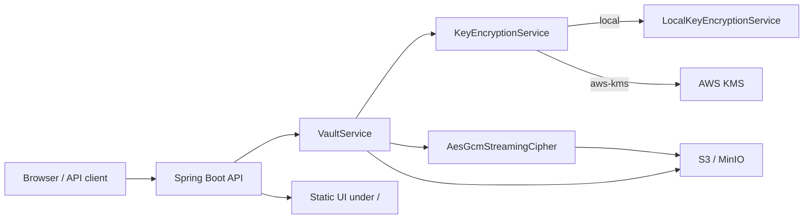
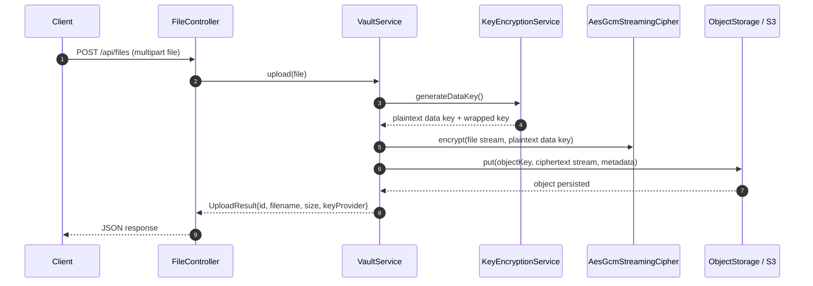
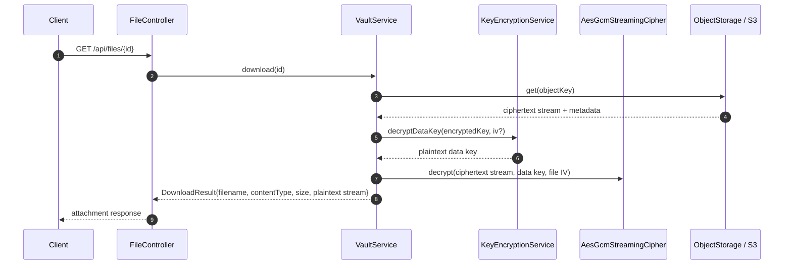
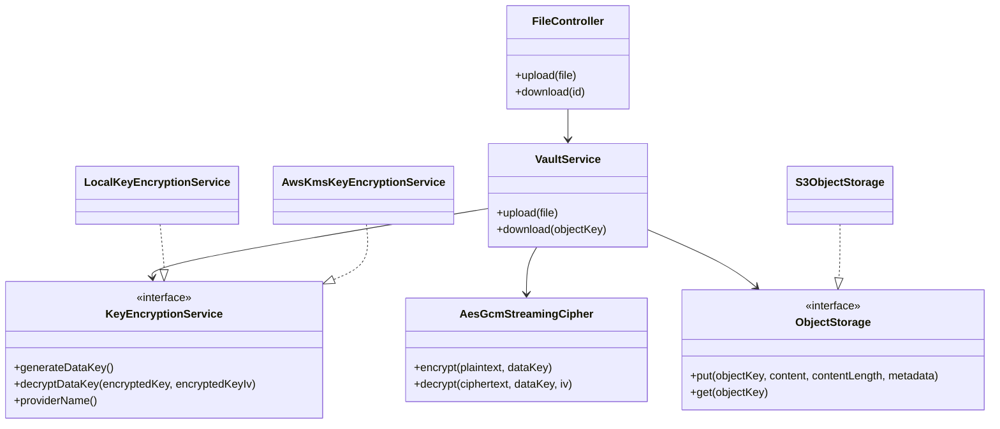
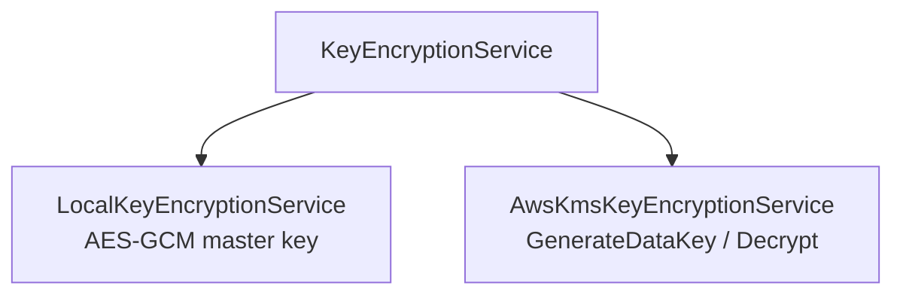
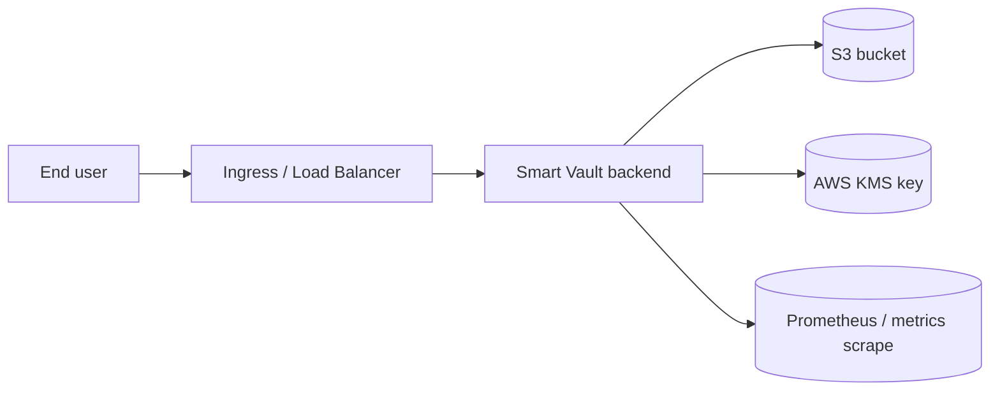

# Smart Vault

Smart Vault is a Spring Boot file vault that combines envelope encryption, S3-compatible object storage, and optional AWS KMS-backed key wrapping. The system accepts arbitrary files, encrypts them before persistence, and reconstructs the plaintext only for an authorized download request.

The repository is organized around three concerns:

- `backend/` contains the HTTP API, encryption pipeline, configuration, and static browser UI.
- `infra/local/` contains a Docker Compose environment for local S3-compatible storage through MinIO.
- `infra/k8s/` and `infra/terraform/aws/` contain deployment scaffolding for Kubernetes and AWS infrastructure.

## System Overview

Smart Vault uses a two-layer crypto model:

1. A random per-file data key encrypts the file contents with AES-256-GCM.
2. That data key is wrapped by either AWS KMS or a locally configured AES-256 master key.

The file ciphertext is streamed directly into S3-compatible storage, while the encryption metadata is stored as S3 object metadata on the same object. That makes each object self-describing and keeps plaintext key material out of durable storage.



## Request Lifecycle

### Upload path



### Download path



## Backend Architecture

The backend is a single Spring Boot application. The key classes are:

- SmartVaultApplication boots the application.
- FileController exposes the HTTP API.
- VaultService orchestrates key generation, encryption, metadata handling, and download reconstruction.
- AesGcmStreamingCipher performs streaming AES/GCM encryption and decryption.
- KeyEncryptionService abstracts key wrapping so the application can switch between local and AWS KMS modes.
- S3ObjectStorage is the storage adapter for S3-compatible backends.
- AppConfig wires AWS clients and credentials.
- ServiceWiringConfig selects the active key wrapping implementation from configuration.



## Cryptographic Design

### Data flow and trust boundaries

Smart Vault separates three different secrets:

- The file plaintext, which exists only while a file is being uploaded or downloaded.
- The per-file data key, which is generated for each upload and used only for one object.
- The master wrapping key, which protects the data key but never encrypts file contents directly.

The cryptographic sequence for a single file is:

1. Generate a fresh 256-bit data key.
2. Generate a 96-bit AES-GCM IV for the file content.
3. Encrypt the file stream with AES/GCM/NoPadding.
4. Wrap the data key using either KMS or the local master key.
5. Persist the ciphertext stream to S3.
6. Persist metadata needed for reconstruction on download.

### AES-GCM details

The file cipher uses AES-GCM because it provides confidentiality and integrity in a single construction. The implementation uses:

- AES-256 keys.
- A 12-byte IV for GCM, which matches the standard nonce size.
- A 128-bit authentication tag.

The code streams data through CipherInputStream, so file contents do not need to be fully buffered in memory. The on-disk ciphertext is roughly the plaintext size plus the GCM authentication tag overhead.

### Metadata stored with each object

The following metadata keys are stored with the S3 object:

- file-iv: Base64-encoded AES-GCM IV for the file ciphertext.
- encrypted-key: Base64-encoded wrapped data key.
- encrypted-key-iv: Base64-encoded IV used only by the local key provider.
- original-filename: original client filename, preserved for download responses.
- original-content-type: original MIME type, used to reconstruct the response content type.
- original-size: original plaintext size.
- key-provider: the active wrapping provider used at upload time.

The application never stores plaintext data keys durably.

## Key Provider Modes

### Local mode

Local mode is intended for development and offline testing. In this mode, the wrapped data key is produced by encrypting the per-file data key with a 32-byte master key using AES-GCM. The encrypted key IV is stored alongside the ciphertext metadata so the data key can be unwrapped later.

Use local mode when you want to run the system without AWS KMS access.

### AWS KMS mode

AWS KMS mode is the production-oriented option. The application calls GenerateDataKey with AES_256 so KMS returns both the plaintext data key and the encrypted data key blob. On download, the encrypted blob is passed back to Decrypt to recover the same plaintext key.

This means the application never needs to persist the plaintext data key itself. KMS becomes the authority for wrapping and unwrapping file keys.



In practice, provider selection is controlled by ServiceWiringConfig:

- local or blank -> LocalKeyEncryptionService
- aws-kms or kms -> AwsKmsKeyEncryptionService
- any other value -> startup failure

## API Contract

### POST /api/files

Uploads a multipart file, encrypts it, and stores the encrypted object in the configured bucket.

Request:

```http
POST /api/files
Content-Type: multipart/form-data

file=<binary file>
```

Successful response:

```json
{
  "id": "8df0f8b8-5e60-4a1f-8b7a-1aa3b8c9d7b8",
  "filename": "report.pdf",
  "size": 1048576,
  "keyProvider": "aws-kms"
}
```

### GET /api/files/{id}

Downloads the encrypted object, decrypts it on the fly, and returns the plaintext file as an attachment.

Response behavior:

- Content-Disposition is set to attachment; filename="...".
- Content-Type is restored from stored metadata when available.
- Content-Length is emitted when the original size is known.

## Configuration Reference

All runtime settings are bound from the smartvault.* namespace in backend/src/main/resources/application.yml.

### Core properties

| Property | Env var | Default | Purpose |
| --- | --- | --- | --- |
| smartvault.key-provider | SMARTVAULT_KEY_PROVIDER | local | Selects local or aws-kms key wrapping |
| smartvault.s3.bucket | SMARTVAULT_S3_BUCKET | smartvault | Target object bucket |
| smartvault.s3.region | SMARTVAULT_S3_REGION | us-east-1 | S3 region |
| smartvault.s3.endpoint | SMARTVAULT_S3_ENDPOINT | empty | Optional custom S3 endpoint for MinIO or other S3-compatible stores |
| smartvault.s3.access-key | SMARTVAULT_S3_ACCESS_KEY | empty | Static S3 credentials for local use |
| smartvault.s3.secret-key | SMARTVAULT_S3_SECRET_KEY | empty | Static S3 credentials for local use |
| smartvault.s3.force-path-style | SMARTVAULT_S3_FORCE_PATH_STYLE | true | Enables path-style addressing for local S3-compatible targets |
| smartvault.kms.region | SMARTVAULT_KMS_REGION | mirrors S3 region | KMS region, if different from S3 |
| smartvault.kms.key-id | SMARTVAULT_KMS_KEY_ID | empty | KMS key ARN or alias |
| smartvault.kms.endpoint | SMARTVAULT_KMS_ENDPOINT | empty | Optional custom KMS endpoint |
| smartvault.local.master-key-base64 | SMARTVAULT_LOCAL_MASTER_KEY_BASE64 | empty | 32-byte Base64 master key for local wrapping |

### Runtime limits and endpoints

- HTTP port: 8080
- Multipart max file size: 200MB
- Multipart max request size: 200MB
- Actuator exposure: health, info, prometheus

## Local Development

### Prerequisites

- Java 17
- Maven 3.9+ or the Maven wrapper if you add one later
- Docker Desktop

### Start MinIO

The local stack is defined in infra/local/docker-compose.yml.

```bash
cd infra/local
docker compose up -d
```

This starts:

- MinIO on http://localhost:9000
- MinIO console on http://localhost:9001
- a bootstrap container that creates the smartvault bucket

### Run the backend in local mode

For local development, configure the application to use the local key provider and point S3 at MinIO:

```powershell
$env:SMARTVAULT_S3_ENDPOINT="http://localhost:9000"
$env:SMARTVAULT_S3_REGION="us-east-1"
$env:SMARTVAULT_S3_BUCKET="smartvault"
$env:SMARTVAULT_S3_ACCESS_KEY="minioadmin"
$env:SMARTVAULT_S3_SECRET_KEY="minioadmin"
$env:SMARTVAULT_S3_FORCE_PATH_STYLE="true"
$env:SMARTVAULT_KEY_PROVIDER="local"

# 32 random bytes, Base64-encoded. Example only.
$env:SMARTVAULT_LOCAL_MASTER_KEY_BASE64="AAAAAAAAAAAAAAAAAAAAAAAAAAAAAAAAAAAAAAAAAAA="
```

Then start the backend:

```bash
cd backend
mvn spring-boot:run
```

Open the built-in static UI at http://localhost:8080/.

### Validate local upload and download

```bash
curl -F "file=@README.md" http://localhost:8080/api/files
curl -L -o out.bin http://localhost:8080/api/files/<id>
```

The JSON response contains the object identifier you use for download.

## AWS KMS Deployment

AWS KMS mode is the intended production configuration. The application calls AWS APIs through the AWS SDK v2 BOM declared in backend/pom.xml.

### Required AWS resources

1. An S3 bucket for encrypted object storage.
2. A symmetric KMS key for envelope encryption.
3. An IAM principal with permissions to write the bucket and use the KMS key.

### Recommended AWS topology



### Console setup

The examples below assume the Mumbai region ap-south-1, but the architecture works in any AWS region as long as S3 and KMS are configured consistently.

#### 1. Create the KMS key

Create a symmetric customer-managed key with encrypt/decrypt usage.

Key policy and IAM policy both matter. If decrypt or data-key generation fails, check both layers:

- IAM identity policy on the user or role.
- KMS key policy on the CMK itself.

#### 2. Create the bucket

Recommended bucket settings:

- Block all public access: enabled
- Versioning: enabled when you need recovery or auditability
- Default encryption: SSE-KMS
- KMS key: the same CMK used by the application

#### 3. Create an IAM principal

Use an IAM role for runtime workloads when possible:

- EC2 instance profile
- ECS task role
- EKS IRSA role

For local AWS development, an IAM user with an access key is the simplest option.

Minimum IAM policy:

```json
{
  "Version": "2012-10-17",
  "Statement": [
    {
      "Sid": "S3ListBucket",
      "Effect": "Allow",
      "Action": ["s3:ListBucket"],
      "Resource": "arn:aws:s3:::YOUR_BUCKET_NAME"
    },
    {
      "Sid": "S3ReadWriteObjects",
      "Effect": "Allow",
      "Action": ["s3:GetObject", "s3:PutObject", "s3:HeadObject"],
      "Resource": "arn:aws:s3:::YOUR_BUCKET_NAME/*"
    },
    {
      "Sid": "KmsEnvelope",
      "Effect": "Allow",
      "Action": ["kms:GenerateDataKey", "kms:Decrypt"],
      "Resource": "YOUR_KMS_KEY_ARN"
    }
  ]
}
```

### Environment variables for AWS mode

```powershell
$env:SMARTVAULT_KEY_PROVIDER="aws-kms"
$env:SMARTVAULT_S3_REGION="ap-south-1"
$env:SMARTVAULT_S3_BUCKET="YOUR_BUCKET_NAME"
$env:SMARTVAULT_KMS_KEY_ID="YOUR_KMS_KEY_ARN"
Remove-Item Env:SMARTVAULT_S3_ENDPOINT -ErrorAction SilentlyContinue
```

Credentials can be supplied either through environment variables or via an AWS profile:

```powershell
$env:AWS_ACCESS_KEY_ID="..."
$env:AWS_SECRET_ACCESS_KEY="..."
# $env:AWS_SESSION_TOKEN="..."
```

or

```powershell
$env:AWS_PROFILE="smartvault"
```

### Build and run

```powershell
cd backend
mvn spring-boot:run
```

Then open http://localhost:8080/.

### Common AWS failure modes

- HTTP 400 ... smartvault.kms.key-id is required: SMARTVAULT_KMS_KEY_ID is missing while key-provider=aws-kms.
- AccessDeniedException from KMS: the IAM policy or key policy does not allow kms:GenerateDataKey or kms:Decrypt.
- PermanentRedirect or region mismatch: the bucket region and SMARTVAULT_S3_REGION do not match.
- AccessDenied from S3: the bucket policy or identity policy does not allow the required S3 actions.

## Kubernetes Deployment

Kubernetes manifests live in infra/k8s/.

The manifests are intentionally minimal and expect you to supply secrets separately. Apply them with:

```bash
kubectl apply -k infra/k8s
```

The kustomization expects a Secret named smartvault-secrets. See infra/k8s/secret.example.yaml for the required shape.

Suggested runtime config in Kubernetes:

- Mount environment variables from the secret rather than hard-coding values in the deployment.
- Point SMARTVAULT_S3_ENDPOINT to an internal S3-compatible service only if you are not using native AWS S3.
- Prefer SMARTVAULT_KEY_PROVIDER=aws-kms in cluster deployments.

## Terraform / AWS Infrastructure

Terraform scaffolding is available under infra/terraform/aws/.

The current layout suggests an AWS EKS-oriented deployment path. The Terraform layer is useful when you want to provision:

- the container orchestration platform,
- networking primitives,
- IAM roles and policies,
- and supporting AWS resources such as S3 and KMS.

Treat the Terraform directory as infrastructure scaffolding rather than a fully opinionated production module set.

## Jenkins Pipeline

The root Jenkinsfile provides CI/CD integration for automated build and deployment workflows. At a minimum, a mature pipeline for this project should validate:

- Maven build and tests for the backend.
- Container image build, if you package the backend into a runtime image.
- Kubernetes or AWS deployment steps, depending on the target environment.

## Static UI

The application serves a small browser UI from the Spring Boot static resources in backend/src/main/resources/static/index.html and backend/src/main/resources/static/app.js.

That UI is intentionally simple:

- upload a file,
- capture the returned object ID,
- download the encrypted object through the backend,
- and verify the round trip without a separate frontend build.

## Operational Notes

- The upload path is streaming, so the application does not need to load the full file body into memory.
- The download path restores the original filename and content type from metadata.
- The stored object key is a random UUID, not the original filename.
- S3 object metadata acts as the reconstruction contract for decryption.
- The application exposes Prometheus metrics at /actuator/prometheus when the actuator endpoint is enabled.

## Security Properties

What Smart Vault does well:

- Encrypts file contents before they reach object storage.
- Uses a fresh data key per object, limiting key reuse blast radius.
- Keeps plaintext data keys out of persistent storage.
- Supports AWS KMS for centralized key policy enforcement and auditability.

What it does not do by itself:

- It does not provide user authentication or authorization.
- It does not implement bucket-level access governance beyond the underlying AWS or MinIO permissions.
- It does not provide document-level search or indexing.
- It does not remove the need to protect the runtime environment, logs, and credentials.

## Repository Layout

```text
Project/
├── backend/                 Spring Boot application and static UI
│   ├── src/main/java        API, crypto, storage, and configuration code
│   ├── src/main/resources   application.yml plus static assets
│   └── src/test/java        crypto-focused tests
├── infra/local              MinIO development stack
├── infra/k8s                Kubernetes manifests and examples
├── infra/terraform/aws      AWS infrastructure scaffolding
└── Jenkinsfile              CI/CD pipeline definition
```

## Troubleshooting Checklist

If upload or download fails, check the following in order:

1. The application is pointing at the correct S3 endpoint and region.
2. The selected key provider matches the available configuration.
3. The local master key is 32 bytes after Base64 decoding when using local mode.
4. The KMS key ID is present when using AWS KMS mode.
5. IAM and KMS key policies allow the principal to generate data keys and decrypt them.
6. The target object exists in the bucket and the bucket name matches the configured value.

## Test Strategy

The repository already contains crypto-focused tests under backend/src/test/java/com/smartvault/crypto.

Recommended testing layers for the backend:

- unit tests for the cipher and key wrapping implementations,
- integration tests against MinIO,
- and end-to-end validation against real AWS S3 and KMS when production credentials are available.

## Why This Design

This design keeps the system compact while preserving a strong security boundary:

- one service owns request handling, encryption, and metadata wiring,
- S3 stores only encrypted blobs,
- KMS or the local master key wraps only the per-file key,
- and the download path can be fully reconstructed from object metadata and the wrapping backend.

That combination makes the implementation easy to reason about, easy to run locally, and straightforward to move to AWS.
